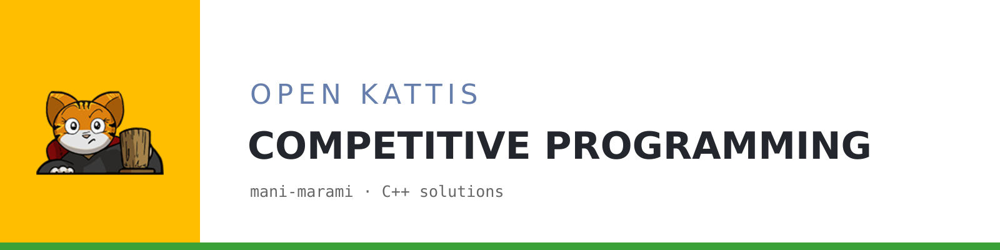

  

This is my folder of C++ solutions to Open Kattis problems.

- [Ball](Ball.cpp)
- [Eeny Meeny](EenyMeeny.cpp)
- [Endian](Endian.cpp)
- [Fancy Frames](FancyFrames.cpp)
- [Fast Food Prizes](FastFoodPrizes.cpp)
- [Marko](Marko.cpp)
- [Sort of Sorting](SortofSorting.cpp)
- [Temperature Confusion](TemperatureConfusion.cpp)
- [Track Smoothing](TrackSmoothing.cpp)
