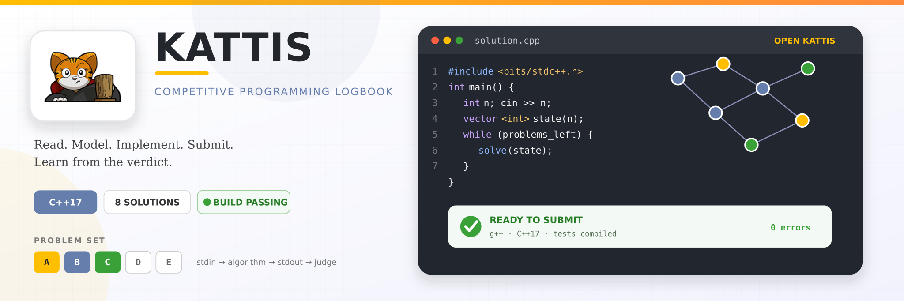

<p align="center">
  
</p>

<p align="center">
  <a href="https://github.com/Denoax/Kattis/actions/workflows/build.yml"></a>
  
  
  <a href="https://open.kattis.com/"></a>
</p>

<p align="center">
  <strong>Read the problem. Model it. Implement it. Submit it. Learn from it.</strong><br>
  My C++ competitive-programming practice from the <a href="https://open.kattis.com/">Open Kattis Problem Archive</a>.
</p>

---

## Problem index

The repository keeps each solution as a small, standalone program. Problem links lead to Kattis; source links lead directly to the implementation.

| # | Kattis problem | Main idea | C++ source |
|:--:|---|---|:--:|
| `01` | [Ball](https://open.kattis.com/problems/ball) | frequency counting | [solution](Ball.cpp) |
| `02` | [Eeny Meeny](https://open.kattis.com/problems/eenymeeny) | simulation · circular elimination | [solution](EenyMeeny.cpp) |
| `03` | Endian | strings · byte-order conversion | [solution](Endian.cpp) |
| `04` | [Fancy Frames](https://open.kattis.com/problems/fancyframes) | grids · ASCII rendering | [solution](FancyFrames.cpp) |
| `05` | [Fast Food Prizes](https://open.kattis.com/problems/fastfood) | counting · greedy evaluation | [solution](FastFoodPrizes.cpp) |
| `06` | [Marko](https://open.kattis.com/problems/marko) | strings · keypad mapping | [solution](Marko.cpp) |
| `07` | [Sort of Sorting](https://open.kattis.com/problems/sortofsorting) | stable sorting | [solution](SortofSorting.cpp) |
| `08` | [Track Smoothing](https://open.kattis.com/problems/tracksmoothing) | geometry · path length | [solution](TrackSmoothing.cpp) |

> **In progress:** [Temperature Confusion](https://open.kattis.com/problems/temperatureconfusion) remains local until the implementation is complete.

## Build and run

Compile every tracked solution with C++17 and common warnings enabled:

```bash
make
```

Run any solution with standard Kattis-style input redirection:

```bash
./build/Ball < input.txt
```

Rebuild everything from a clean directory:

```bash
make check
```

Each file owns its own `main()` and standard input/output contract. There is no shared runtime or framework hiding the submitted program.

## Repository snapshot

```text
SOLUTIONS       8
LANGUAGE        C++17
SOURCE LINES    413
BUILD           GCC + GitHub Actions
CURRENT FOCUS   problem solving fundamentals
```

## Structure

```text
.
├── *.cpp                     one program per Kattis problem
├── template.cpp              blank contest starting point
├── Makefile                  local reproducible build
├── .github/workflows/        Linux compilation in CI
└── assets/                   Kattis-inspired showcase artwork
```

Problem statements and problem names belong to their respective authors and Kattis. The Kattis name and mascot belong to Kattis and are used here only to identify the platform; this is an unofficial personal solution repository.

<p align="center"><sub>One problem at a time. One better model of the problem each time.</sub></p>
